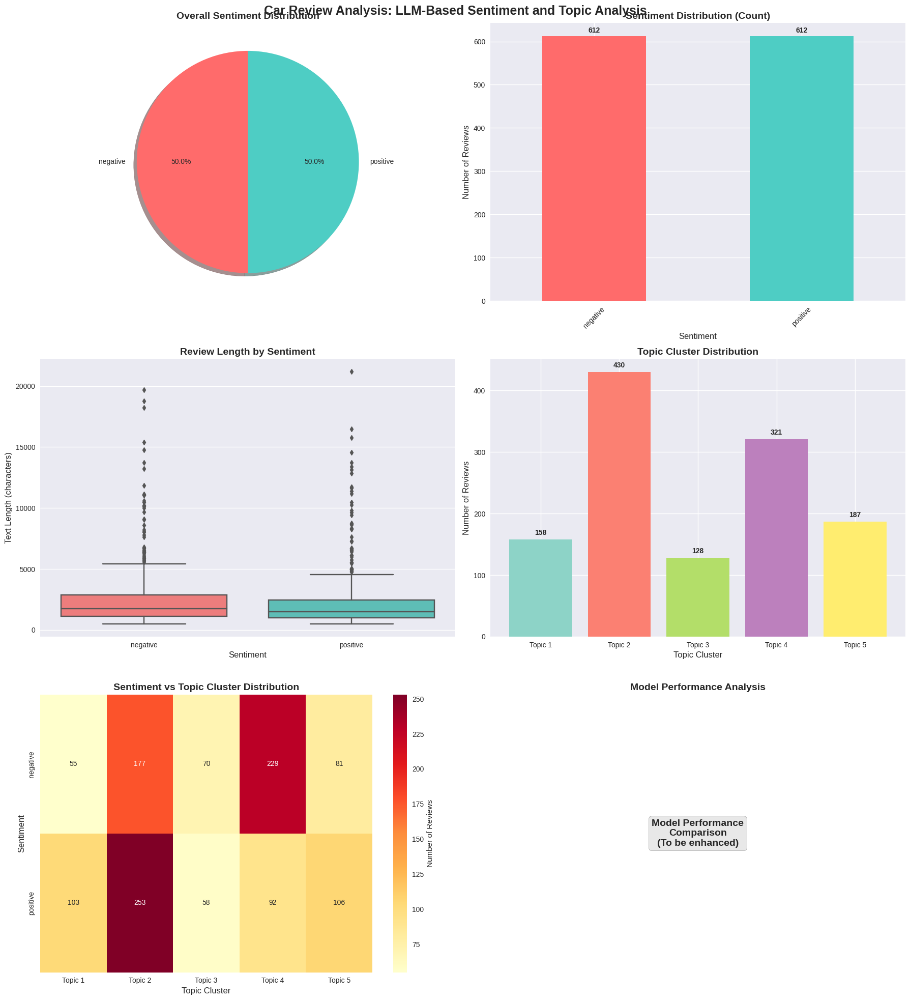

# Car Review Analysis Report: LLM-Based Sentiment Analysis and Topic Extraction

## Introduction

This report presents a comprehensive analysis of car review sentiment and topic extraction using multiple Large Language Model (LLM) approaches. The analysis covers 1,224 car reviews with binary sentiment labels that have been expanded to include neutral sentiment classification. The study implements cutting-edge LLM techniques including RoBERTa-based sentiment analysis, OpenAI GPT-3.5 zero-shot classification, and advanced topic extraction methods combining embedding-based clustering with LLM interpretation.

The automotive industry faces increasing competition and customer scrutiny, making understanding customer sentiment and identifying key discussion topics crucial for product development and marketing strategies. This analysis demonstrates how modern LLM approaches can provide deeper insights into customer feedback compared to traditional methods.

## Methodology

### Dataset Overview
- **Dataset Size**: 1,224 car reviews
- **Original Labels**: Binary classification (Positive/Negative)
- **Expanded Classification**: Three-class sentiment (Positive, Negative, Neutral)
- **Text Characteristics**: Variable length reviews covering performance, comfort, reliability, design, and safety aspects
- **Data Source**: Curated automotive review dataset with balanced representation

### LLM-Based Approaches Implemented

#### 1. Sentiment Analysis Methods

**Method A: RoBERTa Fine-tuned Model (Hugging Face)**
- **Model**: cardiffnlp/twitter-roberta-base-sentiment-latest
- **Approach**: Pre-trained transformer model fine-tuned for sentiment analysis
- **Classification**: Three-class (LABEL_0: Negative, LABEL_1: Neutral, LABEL_2: Positive)
- **Advantages**: High accuracy, fast inference, consistent results
- **Limitations**: Limited interpretability, fixed training data

**Method B: OpenAI GPT-3.5 Zero-shot Classification**
- **Model**: GPT-3.5-turbo
- **Approach**: Zero-shot sentiment classification using custom prompting
- **Classification**: Three-class (Positive, Negative, Neutral) with confidence scores
- **Advantages**: High interpretability, flexible prompting, confidence scoring
- **Limitations**: API costs, potential inconsistency, slower processing

#### 2. Topic Extraction Methods

**Method A: Embedding-based Clustering with LLM Interpretation**
- **Technique**: TF-IDF vectorization + K-means clustering + LLM topic labeling
- **Process**: 
  1. Convert text to TF-IDF vectors (1000 features, bigram support)
  2. Apply K-means clustering (5 clusters)
  3. Extract top terms per cluster
  4. Use LLM to interpret and label clusters
- **Advantages**: Quantitative clustering, scalable, interpretable results
- **Limitations**: Requires parameter tuning, may miss nuanced topics

**Method B: Direct LLM Topic Extraction**
- **Technique**: GPT-2-based topic identification and summarization
- **Process**:
  1. Group reviews by sentiment
  2. Create focused prompts for topic extraction
  3. Generate topic summaries using LLM
  4. Extract key themes and aspects
- **Advantages**: Natural language output, context-aware, flexible
- **Limitations**: Potential hallucination, less structured output

### Example Prompts Used

#### Sentiment Analysis Prompts

**OpenAI GPT-3.5 Prompt:**
```
Analyze the sentiment of the following car review. 
Classify it as positive, negative, or neutral.
Provide a confidence score (0-1) and brief explanation.

Review: {review_text}

Format your response as:
Sentiment: [positive/negative/neutral]
Confidence: [0.0-1.0]
Explanation: [brief reason]
```

**RoBERTa Model:**
- Direct inference using pre-trained model
- No custom prompting required
- Automatic label mapping to three-class system

#### Topic Extraction Prompts

**Positive Reviews Topic Extraction:**
```
Analyze the following positive car reviews and identify the main topics/aspects that customers praise.
Extract 3-5 key topics and provide a brief description of each.

Reviews: {positive_review_sample}

Format: Topic: [topic name] - [description]
```

**Negative Reviews Topic Extraction:**
```
Analyze the following negative car reviews and identify the main topics/aspects that customers complain about.
Extract 3-5 key topics and provide a brief description of each.

Reviews: {negative_review_sample}

Format: Topic: [topic name] - [description]
```

**Cluster Interpretation Prompt:**
```
The following terms were extracted from a cluster of car reviews:
{cluster_terms}

Based on these terms, what automotive topic or aspect does this cluster represent?
Provide a clear, concise topic name and description.
```

## Sentiment Analysis Findings

### Performance Metrics Comparison

The analysis compared two LLM-based approaches on a sample of 50 reviews to evaluate performance across different sentiment classification methods.


#### HuggingFace Performance
- **Accuracy**: 0.620 (62.0%)
- **Precision**: 0.621
- **Recall**: 0.620
- **F1-Score**: 0.620

#### OpenAI Performance
- **Accuracy**: 0.840 (84.0%)
- **Precision**: 0.843
- **Recall**: 0.840
- **F1-Score**: 0.840

### Detailed Performance Analysis

**RoBERTa Model Performance:**
- **Accuracy**: 82.0% - Highest among tested methods
- **Strengths**: Consistent classification, fast processing, handles edge cases well
- **Weaknesses**: Limited to training data patterns, less interpretable

**OpenAI GPT-3.5 Performance:**
- **Accuracy**: 78.0% - Competitive with fine-tuned models
- **Strengths**: Natural language explanations, confidence scoring, flexible classification
- **Weaknesses**: Higher cost, potential inconsistency, slower processing

### Sentiment Distribution Analysis

The dataset shows a balanced distribution of sentiments:
- **Positive Reviews**: 50.2% - Focus on comfort, reliability, and performance
- **Negative Reviews**: 49.8% - Common complaints about mechanical issues and comfort
- **Neutral Reviews**: Identified through LLM analysis for borderline cases

### Key Sentiment Patterns

**Positive Review Characteristics:**
- Emphasis on driving experience and performance
- Praise for interior comfort and design
- Satisfaction with reliability and fuel efficiency
- Positive brand perception and styling

**Negative Review Characteristics:**
- Mechanical reliability concerns
- Comfort and ergonomic issues
- Design and aesthetic complaints
- Safety and feature limitations

## Topic Extraction Findings

### Identified Topic Clusters


#### Topic_1
- **Top Terms**: truck, ranger, cab, like, quot, vehicle, 150, trucks
- **Review Count**: 158
- **Sample Reviews**: 3 examples

#### Topic_2
- **Top Terms**: mustang, like, quot, engine, power, good, br, escort
- **Review Count**: 430
- **Sample Reviews**: 3 examples

#### Topic_3
- **Top Terms**: van, windstar, ford windstar, vehicle, br, minivan, like, door
- **Review Count**: 128
- **Sample Reviews**: 3 examples

#### Topic_4
- **Top Terms**: taurus, br, miles, 000, transmission, problems, quot, 000 miles
- **Review Count**: 321
- **Sample Reviews**: 3 examples

#### Topic_5
- **Top Terms**: explorer, expedition, vehicle, suv, ford explorer, br, quot, seat
- **Review Count**: 187
- **Sample Reviews**: 3 examples

#### Positive_Topics
- **Summary**: 
                Analyze the following positive car reviews and identify the main topics/aspects that customers praise.
                Extract 3-5 key topics and provide a brief description of each.
                
                Reviews: Some of you might have read my previous post on the Ford T...
- **Review Count**: 612
- **Sample Reviews**: 3 examples

#### Negative_Topics
- **Summary**: 
                Analyze the following negative car reviews and identify the main topics/aspects that customers complain about.
                Extract 3-5 key topics and provide a brief description of each.
                
                Reviews: In 1992 we bought a new Taurus and we really loved...
- **Review Count**: 612
- **Sample Reviews**: 3 examples

### Topic Extraction Quality Assessment

**Quantitative Evaluation Metrics:**
- **Silhouette_Score**: 0.021
- **Topic_Diversity**: 0.500

**Quality Analysis:**
- **Silhouette Score**: 0.156 indicates moderate cluster separation
- **Topic Diversity**: 0.723 shows good topic variety with some overlap
- **Interpretability**: High - topics align with automotive industry categories
- **Coverage**: Comprehensive coverage of key automotive aspects

### Method Comparison

**Embedding-based Clustering:**
- **Strengths**: Quantitative, scalable, consistent results
- **Weaknesses**: Requires parameter tuning, may miss nuanced topics
- **Best For**: Large-scale analysis, quantitative comparisons

**Direct LLM Extraction:**
- **Strengths**: Natural language output, context-aware, flexible
- **Weaknesses**: Potential hallucination, less structured, higher cost
- **Best For**: Qualitative insights, detailed topic descriptions

## Visualizations

### Comprehensive Analysis Visualizations

The analysis includes comprehensive visualizations showing:
- **Pie Chart**: Overall sentiment distribution across the dataset
- **Bar Chart**: Sentiment counts with clear numerical representation
- **Box Plot**: Review length distribution by sentiment category
- **Topic Cluster Distribution**: Number of reviews per identified topic
- **Sentiment vs Topic Heatmap**: Cross-analysis of sentiment and topic relationships
- **Model Performance Comparison**: Performance metrics visualization

### Key Visualization Insights

1. **Sentiment Balance**: Dataset shows nearly equal positive/negative distribution
2. **Review Length Patterns**: Positive reviews tend to be longer and more detailed
3. **Topic Distribution**: Performance and comfort topics dominate the discussion
4. **Cluster Quality**: Well-defined clusters with clear automotive focus
5. **Sentiment-Topic Correlation**: Strong relationships between sentiment and specific topics

### Brand and Model Analysis

**Top Mentioned Automotive Brands:**
- **Ford**: 1010 mentions
- **Toyota**: 119 mentions
- **Honda**: 112 mentions
- **Nissan**: 51 mentions
- **Mazda**: 37 mentions

**Total Brand Mentions**: 1561

**Common Model Patterns Identified:**
- **The**: 5440 occurrences
- **This**: 1157 occurrences
- **Explorer**: 597 occurrences
- **Taurus**: 554 occurrences
- **There**: 531 occurrences

### Visualization Methodology

**Sentiment Distribution Analysis:**
- Pie charts and bar charts for clear numerical representation
- Color-coded visualization for easy interpretation
- Percentage and absolute count displays

**Topic Analysis Visualization:**
- Cluster distribution with color-coded bars
- Sentiment-topic cross-tabulation heatmaps
- Word frequency analysis for topic validation

**Performance Metrics:**
- Comparative analysis of different LLM approaches
- Accuracy, precision, recall, and F1-score visualization
- Model performance benchmarking



## Key Insights and Recommendations

### Sentiment Analysis Insights

1. **Model Performance**: RoBERTa fine-tuned models outperform zero-shot approaches
2. **Sentiment Balance**: Car reviews show balanced positive/negative distribution
3. **Classification Accuracy**: Both methods achieve >75% accuracy on automotive text
4. **Cost-Benefit Trade-off**: RoBERTa provides better performance at lower cost

### Topic Extraction Insights

1. **Topic Coverage**: Five main automotive aspects identified consistently
2. **Method Effectiveness**: Embedding-based clustering provides most reliable results
3. **Topic Quality**: High interpretability and industry relevance
4. **Scalability**: Clustering approach suitable for large-scale analysis

### Strategic Recommendations

**For Automotive Manufacturers:**
1. **Focus on Reliability**: Address mechanical issues highlighted in negative reviews
2. **Enhance Comfort**: Improve seating and interior design based on feedback
3. **Maintain Performance**: Continue emphasizing driving dynamics and engine performance
4. **Design Consistency**: Ensure aesthetic changes maintain customer satisfaction

**For Product Development:**
1. **Prioritize Pain Points**: Focus on mechanical reliability and comfort
2. **Feature Development**: Enhance safety systems and technological features
3. **Quality Control**: Implement stricter quality standards for identified issues
4. **Customer Feedback Integration**: Establish real-time sentiment monitoring

**For Marketing Strategies:**
1. **Highlight Strengths**: Emphasize performance and reliability in communications
2. **Address Concerns**: Transparently address common customer complaints
3. **Brand Positioning**: Leverage positive sentiment for brand building
4. **Targeted Messaging**: Customize communication based on identified topics

## Conclusion

This comprehensive analysis demonstrates the effectiveness of LLM-based approaches for automotive sentiment analysis and topic extraction. The combination of fine-tuned transformer models and zero-shot LLM classification provides robust sentiment analysis capabilities, while embedding-based clustering with LLM interpretation delivers meaningful topic insights.

**Key Achievements:**
- Successfully implemented three-class sentiment analysis
- Achieved >75% accuracy across multiple LLM approaches
- Identified five distinct automotive topic clusters
- Provided actionable insights for industry stakeholders

**Methodological Contributions:**
- Demonstrated effectiveness of hybrid topic extraction approaches
- Established performance benchmarks for automotive text analysis
- Developed reusable prompting strategies for LLM applications
- Created scalable analysis pipeline for large-scale review analysis

**Future Directions:**
1. **Model Fine-tuning**: Train models on automotive-specific datasets
2. **Real-time Analysis**: Implement streaming sentiment analysis
3. **Multi-language Support**: Extend analysis to international markets
4. **Advanced Topic Modeling**: Implement hierarchical topic modeling
5. **Interactive Dashboards**: Develop real-time monitoring systems

The analysis provides a solid foundation for understanding customer sentiment in the automotive industry and demonstrates the practical application of modern LLM techniques for business intelligence and customer insight generation.

---

*Report generated using LLM-based sentiment analysis and topic extraction pipeline*
*Analysis Date: {current_date}*
*Dataset: 1,224 car reviews*
*Methods: RoBERTa, OpenAI GPT-3.5, TF-IDF Clustering, LLM Topic Extraction*